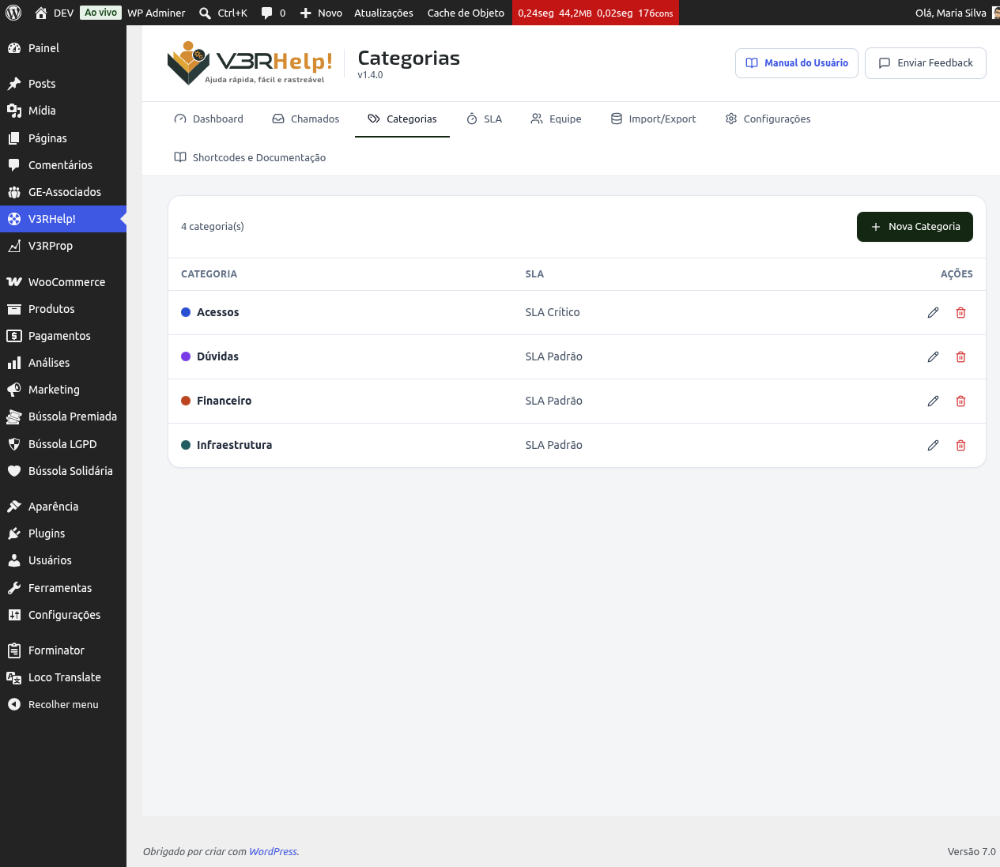

# Categorias
{: .no_toc }

Nesta página

- TOC
{:toc}

As categorias são os "assuntos" dos seus chamados. Em vez de todo pedido cair numa fila única e genérica, você organiza tudo por tema — Financeiro, Acesso, Manutenção, e assim por diante. Isso ajuda sua equipe a entender rápido do que se trata cada chamado e, quando configurado, direciona o pedido para quem entende do assunto.

Você encontra essa tela em **V3RHelp! > Categorias**, no menu do painel do WordPress.

## Como criar uma categoria

1. Clique no botão **Nova Categoria**, no topo da tela.
2. Preencha o **Nome** — algo curto e direto, que qualquer pessoa da equipe reconheça de cara (ex.: "Financeiro", "Acesso ao sistema").
3. Escolha uma **Cor** para a categoria. Ela vira uma etiqueta visual nos chamados.
4. Se quiser, vincule uma **Política de SLA** — o prazo que os chamados dessa categoria devem seguir.
5. Salve.

{: .exemplo }
> Uma empresa que usa o V3RHelp para o suporte pode criar as categorias "Acessos", "Financeiro" e "Problemas técnicos". Um chamado sobre uma fatura vai para "Financeiro"; um sistema fora do ar vai para "Problemas técnicos" — cada um com seu prazo e sua cor na fila. As categorias são livres: cada organização define as que fazem sentido para o seu segmento.

## Editando e excluindo

Para editar, clique na categoria na lista e ajuste nome, cor ou SLA. Para excluir, use a ação de exclusão na própria linha da categoria — vale lembrar que categorias já usadas em chamados abertos merecem atenção antes de serem removidas, para não deixar chamados "órfãos" de categoria.

## Os campos, um a um

**Nome**
: O que aparece para o solicitante e para o operador ao escolher ou visualizar o chamado. Prefira nomes que qualquer pessoa da equipe reconheça sem precisar perguntar "o que é isso?".

**Cor**
: Uma etiqueta visual que aparece junto ao chamado nas listagens. Serve para bater o olho e já saber do que se trata, sem precisar abrir o chamado.

**Política de SLA**
: O prazo de atendimento vinculado à categoria. É opcional, mas quando definido, todo chamado daquela categoria herda esse prazo automaticamente.

{: .importante }
> Vincular uma categoria a uma Política de SLA define o prazo que aquele chamado vai seguir assim que for aberto. Sem esse vínculo, o chamado fica sem um prazo automático — e sua equipe perde a régua de "isso está atrasado ou não". Se prazo importa para o seu suporte, não pule esse campo.

{: .importante }
> A categoria certa também é o que faz o rodízio de operadores (configurado na tela de Equipe) funcionar direito: cada categoria pode ter operadores responsáveis, e o chamado é distribuído entre eles. Uma categoria mal escolhida — ou chamados sempre caindo em "Geral" — quebra esse direcionamento e sobrecarrega quem menos deveria atender aquele assunto.

## Grupo padrão da categoria

Cada categoria pode apontar um **Grupo padrão** de operadores. Quando você define esse campo, todo chamado novo daquela categoria cai direto no grupo (compartilhado), em vez de ser distribuído a um operador pelo rodízio. É a forma mais direta de fazer um time inteiro receber os chamados de um assunto e se organizar entre si. Se você deixar o campo vazio, o rodízio individual de sempre continua valendo. Veja [Grupos](grupos) para entender como o time trabalha a partir daí.

{: .dica }
> Use cores que contrastem bem entre si, principalmente se você tiver muitas categorias. Isso facilita reconhecer a fila de longe, sem precisar ler nome por nome.

## Limite no plano gratuito

No plano gratuito, você pode cadastrar até **5 categorias**. Se sua operação precisar de mais assuntos que isso, o recurso pago libera categorias ilimitadas.

{: .dica }
> Antes de criar uma categoria nova, veja se um assunto já existente não cobre o caso. Poucas categorias bem definidas costumam funcionar melhor do que muitas categorias parecidas — e ajudam a não estourar o limite do plano gratuito à toa.

## Onde as categorias aparecem depois

As categorias alimentam o **ranking do Dashboard**, mostrando quais assuntos geram mais chamados e como anda o cumprimento de prazo por tema. Isso ajuda a enxergar, por exemplo, se "Financeiro" está sempre estourando o SLA — um sinal de que vale reforçar a equipe ou revisar o prazo daquela categoria.
