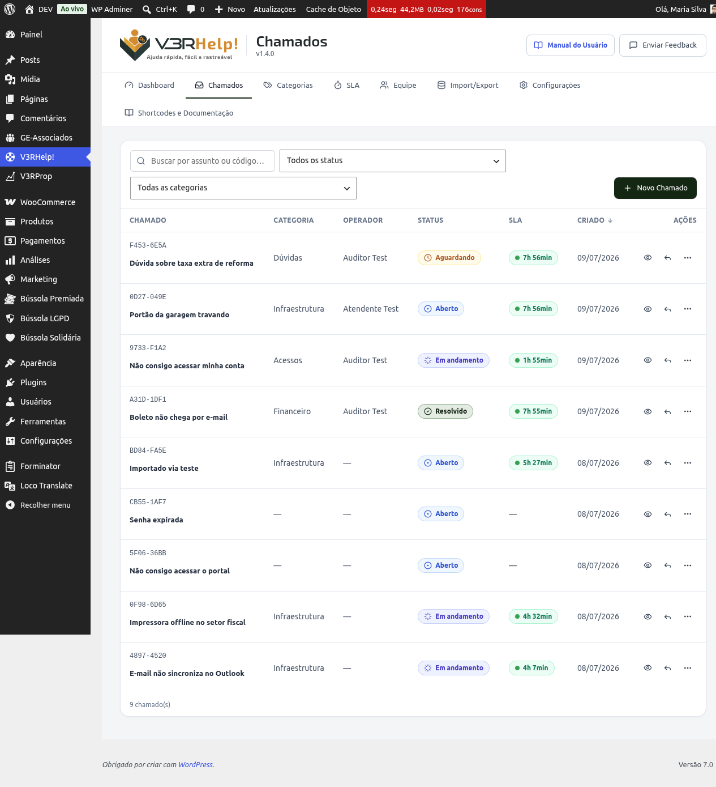
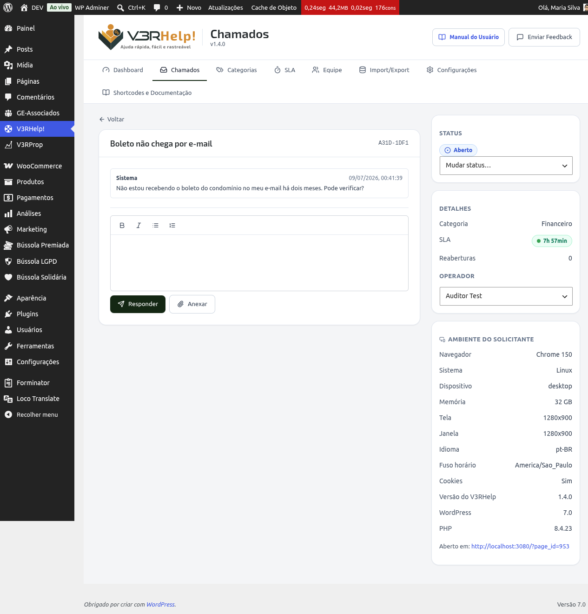

# Chamados
{: .no_toc }

É aqui que o suporte acontece. A tela **Chamados** tem duas partes: a **lista** (a fila) e o
**detalhe** de um chamado.

  
Nesta página

- TOC
{:toc}

---

## A lista de chamados

Abra **V3RHelp! > Chamados**. Você vê todos os chamados, com código, assunto, **solicitante**
(quem abriu — nome e e-mail), categoria, operador, status, SLA e data.

- **Filtros** por status e categoria, e uma **busca** por assunto ou código.
- **Ordenação** clicando nos cabeçalhos das colunas.
- **Ações rápidas** em cada linha: abrir, responder, ou "marcar como…" (mudar o status).
- **Novo Chamado** para abrir um chamado em nome de alguém (por telefone, por exemplo).

{: .importante }
> O **semáforo de SLA** na lista mostra, num olhar, quais chamados estão no prazo, em atenção
> ou vencidos. É ele que ajuda a equipe a decidir **o que atacar primeiro** — priorizar pelo
> vermelho evita estourar prazos e clientes insatisfeitos.

## O detalhe do chamado

Clique em um chamado para abri-lo. À esquerda ficam a conversa e as ações; à direita, um
resumo — com o **Solicitante** (nome e e-mail de quem abriu), categoria, SLA, reaberturas, os
**anexos** e o ambiente.

### Responder e anotar

- **Responder:** escreve uma mensagem que o **solicitante recebe** (por e-mail e no chamado).
- **Nota interna:** um registro **visível só para a equipe** — use para raciocínio,
  verificações e combinados internos.
- **Anexar:** adicione **um ou vários arquivos** à sua resposta. Os arquivos escolhidos ficam
  listados como pendentes (com um **×** para remover) e sobem junto quando você envia. Cada
  anexo aparece **na mesma mensagem** em que foi enviado, dentro da conversa.
- **Documento entregue:** ao responder (sem ser nota interna), marque **"Documento entregue"**
  para avisar o solicitante de que há um documento disponível. A mensagem ganha o selo
  **"Documento disponível"** na conversa e o solicitante recebe um **e-mail específico** com o
  botão para acessar o chamado e baixar o anexo. Use quando o V3RHelp funciona como
  **protocolo** (ver [Formulários](/modulos/formularios/)).

{: .importante }
> Diferenciar **resposta** de **nota interna** é o que mantém a comunicação limpa: o cliente
> recebe só o que interessa a ele, e a equipe preserva seu histórico técnico sem poluir a
> conversa. Registrar sempre evita que, ao trocar de operador, o atendimento recomece do zero.

{: .atencao }
> Anexos enviados numa **nota interna** ficam **só para a equipe** — não aparecem para o
> solicitante na página pública do chamado. Use isso quando o arquivo (um log, um print
> interno) não deve ser visto por quem abriu.

### Ver e remover anexos

No resumo à direita, o card **Anexos** lista todos os arquivos do chamado. Cada um abre em uma
nova aba ao clicar; o ícone de lixeira **remove** o anexo (do chamado e da biblioteca de
mídia). A remoção é permanente.

### Mudar o status

Use **"Mudar status…"** para levar o chamado por seu ciclo (Aberto → Em andamento →
Aguardando → Resolvido). O sistema só oferece as transições válidas.

{: .importante }
> Manter o status **atualizado** é o que faz os relatórios e os prazos fazerem sentido. Um
> chamado resolvido que continua "Em andamento" distorce os números e some da conta de quem
> precisa de ação. Ao concluir, marque **Resolvido** — o solicitante é avisado na hora.

{: .dica }
> Você não precisa mover para **Em andamento** na mão: assim que a equipe **responde** um
> chamado que está em *Aberto*, *Aguardando* ou *Reaberto*, ele passa **sozinho** para *Em
> andamento*. Menos cliques, status sempre coerente com o atendimento.

### Designar um operador ou um grupo

No resumo à direita, o seletor **Designar a** lista os **Operadores** e os **Grupos**
separadamente. Escolha um operador para dar um dono único ao chamado, ou um **grupo** para deixá-lo
compartilhado com um time inteiro. Chamados sem dono tendem a ser esquecidos.

Quando o chamado está com um grupo, os membros veem os botões **Assumir** (pegar o chamado para si)
e, depois, **Devolver ao grupo**. Entenda o fluxo completo em [Grupos](grupos).

{: .importante }
> A **designação** dá um dono claro ao chamado. Sem responsável, ninguém sabe de quem é a vez
> — e é assim que pedidos "caem no vão". Se sua organização usa rodízio por categoria, a
> designação automática já cuida disso na abertura.

{: .dica }
> Ao **transferir** um chamado, os dois lados são avisados por e-mail: o **novo** operador
> recebe "designado a você" e o **anterior**, "você não está mais neste chamado". Ninguém
> descobre por acaso que deixou (ou ganhou) um chamado.

### Reabrir

Um chamado resolvido volta ao fluxo de duas formas:

- **O solicitante responde** o chamado resolvido → ele **reabre automaticamente**, sem
  precisar de botão. É o caminho mais comum, e o operador responsável é avisado.
- **A equipe reabre** pelo botão **Reabrir**, informando o motivo.

Há um **limite de reaberturas** configurável. Quando o limite é atingido e o solicitante
responde de novo, em vez de reabrir o sistema **abre um novo chamado vinculado** ao anterior —
com a mensagem enviada e uma referência ao chamado de origem —, para não perder nem o
histórico nem a nova solicitação.

{: .importante }
> A reabertura automática ao responder fecha uma lacuna comum: o cliente respondia um chamado
> "resolvido" e a mensagem passava despercebida. Agora responder **traz o chamado de volta**
> para a fila — e, se já houve reaberturas demais, o assunto continua num chamado novo, limpo
> e rastreável.

### Dados do formulário

Se o chamado foi aberto por um **tipo de solicitação** com campos personalizados (ver
[Formulários](/modulos/formularios/)), o resumo à direita mostra o bloco **Dados do formulário**
com tudo o que o solicitante preencheu — cada campo com seu rótulo e valor, incluindo o
**consentimento LGPD** (com a data e hora do aceite), quando houver. O bloco só aparece quando há
dados a mostrar.

### Ambiente do solicitante

No resumo, o painel **Ambiente do solicitante** mostra navegador, sistema operacional, tela e
versões — capturados automaticamente na abertura.

{: .importante }
> Saber o **ambiente** de quem abriu o chamado poupa uma rodada inteira de perguntas ("qual
> navegador? qual dispositivo?") e ajuda a reproduzir problemas que só acontecem em certas
> configurações. É diagnóstico na hora, sem incomodar o solicitante.
