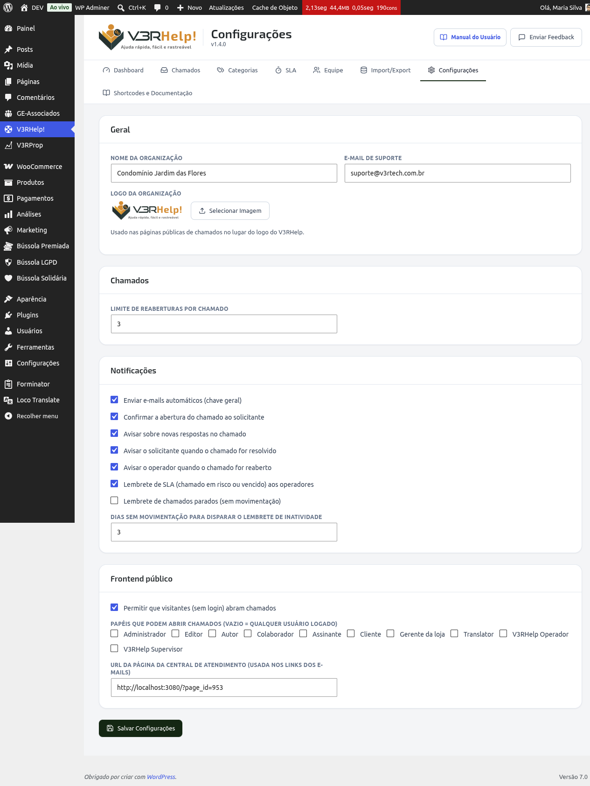

# Configurações
{: .no_toc }

Em **V3RHelp! > Configurações** ficam os ajustes gerais do sistema, organizados em grupos.

  
Nesta página

- TOC
{:toc}

---

## Geral (a identidade da organização)

- **Nome da organização** — aparece no painel e no **cabeçalho dos e-mails**.
- **E-mail de suporte** — usado como remetente das mensagens automáticas.
- **Logo da organização** — enviada para a biblioteca de mídia; aparece nas páginas públicas
  de chamado e no **topo dos e-mails**.

{: .importante }
> Preencher o **nome, o e-mail e a logo** dá aos e-mails e às páginas a cara da sua
> organização. Quem recebe um chamado confia mais numa mensagem que parece vir de "você" do
> que de um sistema genérico — e isso reduz e-mails ignorados como se fossem spam.

## Chamados

- **Limite de reaberturas por chamado** — quantas vezes um chamado resolvido pode ser reaberto.

{: .importante }
> O limite de reaberturas evita que um único chamado vire uma conversa infinita. Quando o
> limite é atingido, o ideal é abrir um novo chamado — o que mantém o histórico organizado.

## Notificações

A **chave geral** liga ou desliga os e-mails automáticos. Abaixo dela, você controla **cada
tipo** de aviso:

- Confirmar a abertura do chamado ao solicitante
- Avisar sobre novas respostas
- Avisar o solicitante quando o chamado for resolvido
- Avisar o operador quando o chamado for reaberto
- **Lembrete de SLA** (chamado em risco ou vencido) aos operadores
- **Lembrete de chamados parados (inatividade)** — e, ao lado, **quantos dias** sem
  movimentação disparam o lembrete

{: .importante }
> Os **lembretes** são o que impede um chamado de ser esquecido. O aviso de SLA faz a equipe
> agir antes de estourar o prazo; o lembrete de inatividade cutuca chamados que ficaram
> parados — sugerindo, inclusive, marcar como Resolvido o que já foi concluído. Ajuste os
> dias para o ritmo real da sua equipe: um número baixo demais vira spam; alto demais deixa
> chamados esfriarem.

{: .dica }
> Os lembretes rodam por uma tarefa agendada (a cada hora) do WordPress. Se os e-mails
> automáticos não estiverem chegando, confira com o responsável técnico se o **WP-Cron** do
> site está ativo.

## Frontend público

- **Permitir que visitantes (sem login) abram chamados** — habilita a abertura por quem não
  tem conta (com nome + e-mail e magic link).
- **Papéis que podem abrir chamados** — se vazio, qualquer usuário logado pode; senão,
  restringe aos papéis escolhidos.
- **URL da página da Central de Atendimento** — o endereço da página onde você publicou o
  shortcode `[v3rhelp_central]`. É usado para montar os **links dos e-mails**.

{: .importante }
> Definir a **URL da Central** garante que os botões "Acompanhar meu chamado" dos e-mails
> levem a pessoa exatamente para a página certa — inclusive nos avisos enviados
> automaticamente, que não têm como adivinhar esse endereço sozinhos.

{: .atencao }
> Liberar a abertura para **visitantes** é ótimo para acessibilidade, mas exponha o formulário
> a spam. Combine com boas categorias e, se necessário, avalie proteção anti-spam no site.
