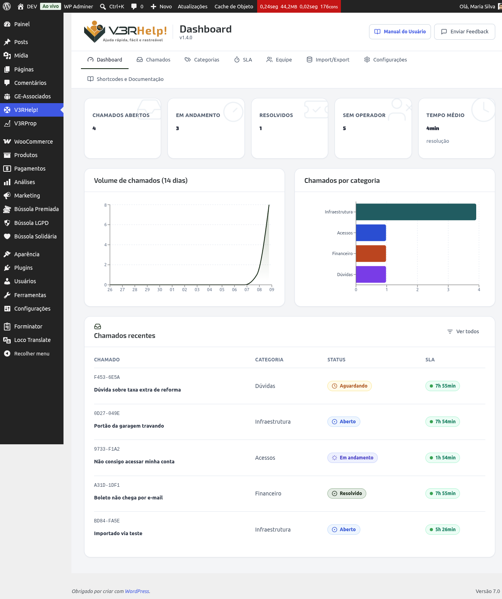

# Dashboard
{: .no_toc }

  

    Índice
  

  {: .text-delta }
1. TOC
{:toc}

O Dashboard é a primeira tela que você vê ao entrar no V3RHelp!. Ele reúne, em um só lugar, os números e gráficos que mostram como está a operação de atendimento agora — e ajuda a decidir onde prestar atenção primeiro.

## Os indicadores (KPIs)

No topo da tela ficam os números principais:

- **Chamados abertos** — quantos chamados estão aguardando início de atendimento.
- **Em andamento** — quantos chamados já têm um operador trabalhando neles.
- **Resolvidos** — quantos chamados foram concluídos no período mostrado.
- **Sem operador** — quantos chamados ainda não foram designados para ninguém.
- **Tempo médio** — o tempo médio que os chamados levam para ser resolvidos.

{: .importante }
> Fique de olho no **Sem operador**. Um número alto aqui significa que existem chamados parados, sem ninguém responsável por eles — é o sinal mais claro de que algo precisa ser designado agora.

{: .importante }
> Se o **Tempo médio** começar a subir ao longo dos dias, é um alerta de sobrecarga da equipe. Vale rever a distribuição de chamados entre operadores antes que os prazos comecem a estourar.

## Os gráficos

- **Volume de chamados nos últimos 14 dias** — um gráfico de área mostrando quantos chamados chegaram por dia nas últimas duas semanas. Ajuda a enxergar padrões e antecipar dias de pico.
- **Chamados por categoria** — um ranking em barras com as categorias que mais geram chamados. É útil para identificar problemas recorrentes e atacar a causa raiz, em vez de só resolver os sintomas um a um.

{: .dica }
> Vale criar o hábito de olhar o Dashboard toda manhã, antes de começar o dia. Em poucos segundos você já sabe se há chamados sem operador, se o tempo médio está subindo e se alguma categoria está pedindo atenção.

## Chamados recentes

Logo abaixo dos gráficos fica a lista de **Chamados recentes**, com os últimos chamados registrados no sistema — um atalho rápido para abrir e acompanhar o que acabou de chegar.

## Sobre os gráficos avançados

Os gráficos e relatórios mais detalhados do Dashboard fazem parte do plano Pro. Se o seu plano ainda não inclui esse recurso, a tela exibe um aviso no lugar dos gráficos, indicando que a funcionalidade está desligada.
</content>
