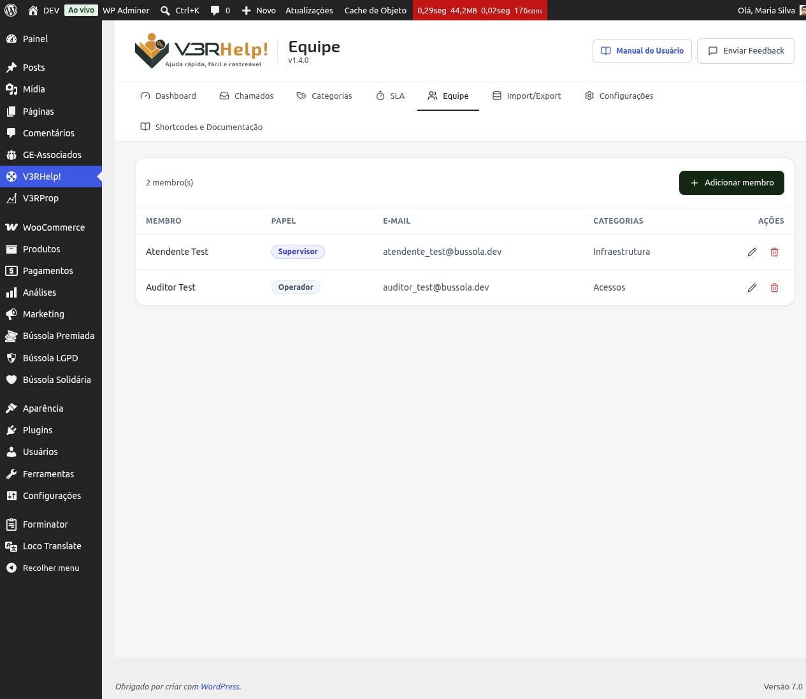

# Equipe
{: .no_toc }

  

    Índice
  

  {: .text-delta }
1. TOC
{:toc}

Na tela **V3RHelp! > Equipe** você organiza quem atende os chamados: quem são os operadores, quem são os supervisores e quais categorias cada operador cobre.

## O que é a Equipe

Todo membro da equipe de suporte é, antes de tudo, um usuário do WordPress. Ao adicioná-lo na tela Equipe, ele é promovido a um dos dois papéis do V3RHelp:

- **Operador** — atende chamados. Pode ser designado automaticamente pelo rodízio ou receber chamados manualmente.
- **Supervisor** — além de atender chamados, coordena a equipe: acompanha o andamento geral, redistribui chamados e gerencia a própria tela de Equipe.

## Adicionar um membro

1. Clique em **Adicionar membro**.
2. Escolha o usuário do WordPress que vai integrar a equipe.
3. Defina o papel: Operador ou Supervisor.
4. Se for Operador, marque as **Categorias** que ele atende.
5. Salve.

## Editar um membro

Abra o membro na lista para trocar o papel (Operador ↔ Supervisor) ou ajustar as categorias que ele atende. As mudanças valem a partir do próximo chamado a ser designado — chamados já atribuídos não são movidos automaticamente.

## Remover um membro

Remover tira a pessoa da equipe de atendimento: ela deixa de aparecer no rodízio e de poder ser designada para novos chamados.

{: .atencao }
Remover um membro **revoga o papel do V3RHelp**, não exclui o usuário do WordPress. A pessoa continua existindo normalmente como usuário — ela só deixa de fazer parte da equipe de suporte.

## Categorias e o rodízio

Cada operador pode ter uma ou mais categorias marcadas. Isso alimenta o **rodízio** (round-robin): quando um chamado é aberto numa categoria, o sistema designa automaticamente o próximo operador elegível daquela categoria, alternando entre eles a cada novo chamado.

Se um operador não tem nenhuma categoria marcada, ele entra no rodízio de **todas** as categorias.

{: .importante }
Distribuir os operadores por categoria coloca cada chamado com quem realmente entende do assunto e equilibra a carga de trabalho — assim ninguém fica sobrecarregado enquanto outros ficam ociosos.

{: .importante }
A designação automática pelo rodízio evita chamados "sem dono": todo chamado novo já nasce com um responsável definido, sem depender de alguém escolher manualmente.

{: .dica }
O rodízio pode ser **ligado ou desligado** em **Configurações > Chamados** ("Designar operador automaticamente por rodízio ao abrir o chamado"). Desligado, os chamados abrem **sem operador**, para um supervisor fazer a triagem e distribuir à mão.

{: .exemplo }
João atende as categorias "Financeiro" e "Acesso"; Maria atende "Manutenção". Ao abrir um chamado na categoria Financeiro, o rodízio designa automaticamente João — porque é o operador elegível para aquela categoria.

## Próximos passos

- [Grupos](grupos.html) — reúna operadores em times para atenderem chamados em conjunto.
- [Categorias](categorias.html) — como criar e organizar as categorias usadas na Equipe.
- [Chamados](chamados.html) — como um chamado é designado e pode ser redistribuído.
