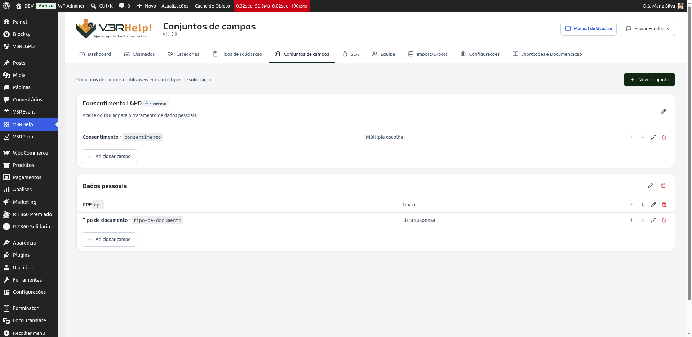
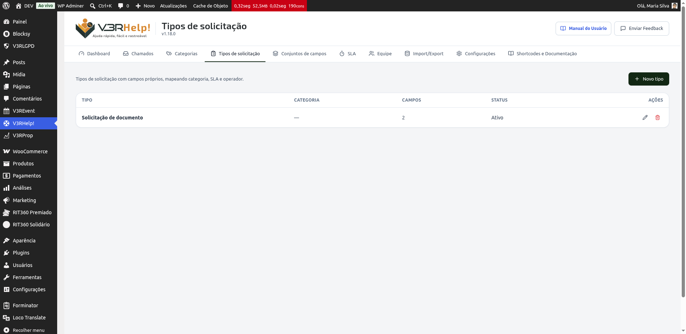

# Formulários personalizados
{: .no_toc }

Cada organização pede coisas diferentes num chamado. Um suporte técnico quer saber o
equipamento; uma secretaria que emite documentos quer o CPF e o tipo de documento. Os
**formulários personalizados** deixam você montar exatamente os campos que precisa, por
**tipo de solicitação** — sem depender de programação.

  
Nesta página

- TOC
{:toc}

---

## As duas peças: conjuntos de campos e tipos de solicitação

O construtor tem duas telas no menu **V3RHelp!**, e elas trabalham juntas:

- **Conjuntos de campos** — grupos de perguntas que você cria uma vez e **reaproveita** em
  vários formulários. Exemplos: "Identificação do solicitante", "Dados pessoais",
  "Consentimento LGPD".
- **Tipos de solicitação** — os formulários em si. Cada tipo é montado **encaixando conjuntos
  de campos** na ordem que você quiser, e pode apontar para uma categoria, um SLA e um operador.

{: .dica }
> Pense assim: os **conjuntos** são as peças de montar; os **tipos** são o que você monta com
> elas. Como as peças são reutilizáveis, você não recria "Dados pessoais" toda vez.

---

## Passo 1 — Criar um conjunto de campos

1. No menu, abra **V3RHelp! > Conjuntos de campos** e clique em **Novo conjunto**.
2. Dê um nome (ex.: "Dados pessoais") e salve.
3. No conjunto, clique em **Adicionar campo**. Para cada campo você define:
   - **Rótulo** — o que o solicitante lê (ex.: "CPF").
   - **Tipo** — Texto, Texto longo, **E-mail**, Número, Data, Lista suspensa, Escolha única,
     Múltipla escolha ou Arquivo. (O tipo **E-mail** confere se o endereço é válido no envio.)
   - **Obrigatório** — se o campo precisa ser preenchido.
   - **Texto de ajuda** — uma dica que aparece abaixo do campo.
   - Em campos de **seleção**, as **opções** (uma por linha). Em **texto** e **número**, regras
     como **máximo de caracteres**, **mínimo/máximo** e **máscara** (CPF, CNPJ, telefone).

{: .importante }
> **Por que isso é importante — a validação protege os dois lados.** Uma máscara de **CPF**, de
> **CNPJ**, de **telefone** ou de **CEP** não deixa passar um número inválido, e um campo
> **obrigatório** garante que a informação essencial venha logo na abertura. Menos idas e vindas,
> atendimento mais rápido.

### Campos condicionais (aparecem só quando precisam)

Ao criar ou editar um campo, você pode marcar **"Mostrar este campo só sob condição"** e escolher
um **campo controlador**, uma condição (**é igual a** / **é diferente de**) e um **valor**.
Exemplo: um campo "CNPJ" que só aparece quando "Tipo de pessoa" for "Jurídica".

No formulário, o campo aparece e some **na hora**, conforme o solicitante responde. E o sistema é
esperto: um campo que está **oculto** não é cobrado como obrigatório nem é gravado no chamado.

{: .dica }
> O campo controlador precisa estar **no mesmo conjunto** do campo condicional. Coloque os dois
> no mesmo conjunto de campos para a condição funcionar.

### O conjunto "Consentimento LGPD" já vem pronto

O V3RHelp cria automaticamente um conjunto **Consentimento LGPD** (marcado como **"Sistema"** —
por isso não pode ser excluído). Ele traz um campo de aceite pronto para usar. Você também pode
marcar **qualquer** campo de múltipla escolha como **campo de consentimento**: quando o
solicitante aceita, o chamado registra **o texto do aceite e a data e hora**.

{: .dica }
> Precisa coletar consentimento? Basta **encaixar o conjunto "Consentimento LGPD"** no tipo de
> solicitação — não precisa recriar nada.

---

## Passo 2 — Criar um tipo de solicitação

1. Abra **V3RHelp! > Tipos de solicitação** e clique em **Novo tipo**.
2. Dê um nome (ex.: "Solicitação de documento") e, se quiser, uma descrição.
3. Escolha, se fizer sentido, a **Categoria**, a **Política de SLA** e o **Operador padrão** —
   assim os chamados desse tipo já entram organizados e no prazo certo.
4. Em **Conjuntos de campos**, adicione os conjuntos na ordem em que devem aparecer no
   formulário (use as setas para reordenar).
5. Marque **Ativo** para o tipo aparecer no formulário público. Marque **Padrão** para ele já vir
   selecionado.

{: .importante }
> **Por que isso é importante — o tipo já organiza o chamado.** Ao ligar o tipo a uma
> **categoria** e um **operador**, todo chamado aberto por ali já cai na fila certa, com o prazo
> certo e com a pessoa certa — sem triagem manual.

---

## Como fica para quem abre o chamado

Na [Central de Atendimento](/modulos/frontend-publico/), se houver mais de um tipo ativo, o
solicitante escolhe o **Tipo de solicitação** e o formulário mostra os campos daquele tipo. Ele
preenche só o que interessa, e a equipe vê tudo reunido no bloco **"Dados do formulário"**, tanto
no painel quanto na própria Central.

{: .atencao }
> Se você **não** criar nenhum tipo de solicitação, o formulário de abertura continua como sempre
> foi (Assunto, Categoria e Descrição). Nada muda até você decidir usar os formulários.

---

## Usar como protocolo (pedir e entregar documentos)

Juntando as peças, o V3RHelp vira um **protocolo**: crie um tipo "Solicitação de documento" com
os campos do pedido; quando o documento estiver pronto, o operador responde e marca a resposta
como **documento entregue** — o solicitante é avisado por e-mail. O passo da entrega está em
[Chamados](/modulos/chamados/).
