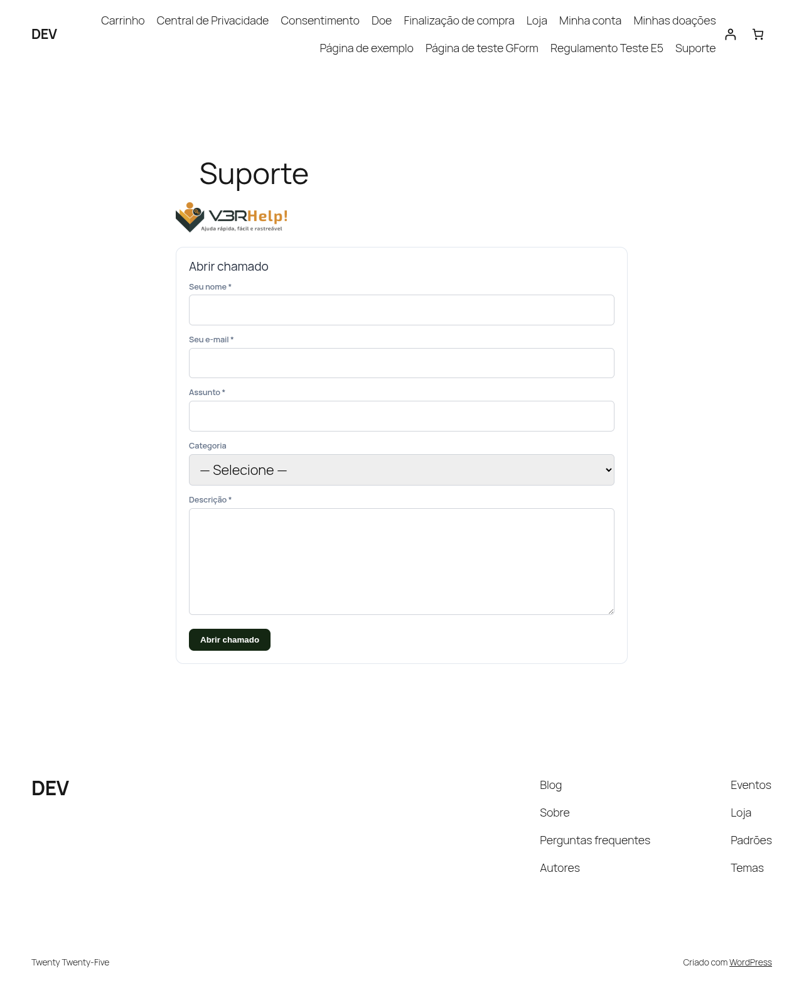
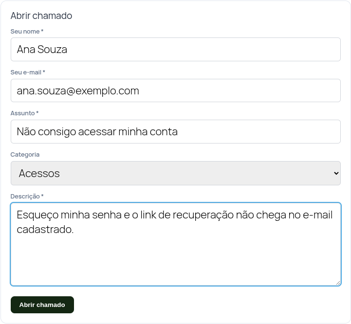

# Central de Atendimento (público)
{: .no_toc }

Diferente das outras telas, esta **não fica no painel**: é uma página do seu **site**, feita
para quem abre chamados. Você a cria uma vez e divulga o link.

  
Nesta página

- TOC
{:toc}

---

## Como publicar a Central

Você tem duas formas equivalentes de colocar o atendimento em uma página:

- **Shortcode:** cole `[v3rhelp_central]` no conteúdo de uma página.
- **Bloco Gutenberg:** no editor, procure por **"V3RHelp"** e insira o bloco **Central**.

Há shortcodes/blocos para necessidades específicas:

| Shortcode | Bloco | Para quê |
|---|---|---|
| `[v3rhelp_central]` | V3RHelp — Central | Abertura + acompanhamento (recomendado) |
| `[v3rhelp_open_ticket]` | V3RHelp — Abrir chamado | Só o formulário de abertura |
| `[v3rhelp_my_tickets]` | V3RHelp — Meus chamados | Lista dos chamados do usuário logado |
| `[v3rhelp_ticket]` | — | Detalhe de um chamado (via magic link) |

{: .importante }
> Depois de publicar a Central, copie o endereço dela e coloque em
> **Configurações > Frontend público > URL da Central de Atendimento**. É esse endereço que
> os **e-mails** usam nos botões de acompanhamento — sem ele, os links caem na página inicial.

## Como as pessoas abrem um chamado

1. A pessoa preenche assunto, categoria e descrição (e nome/e-mail, se não tiver conta).
2. Anexa prints/arquivos, se quiser.
3. Envia e recebe um **e-mail de confirmação** com o número e um botão para acompanhar.

Logo após enviar, a própria tela já mostra uma **mensagem de confirmação** clara ("Seu chamado
foi aberto e já entrou na fila de atendimento…") e abre o **acompanhamento** do chamado — a
pessoa não fica sem saber o que aconteceu.

Quem **não tem conta** recebe um **magic link** — um link seguro para acompanhar e responder
sem precisar criar login.

## Acompanhar e responder

Na tela de acompanhamento, a pessoa vê a conversa do chamado e pode **responder** — com texto
e, se precisar, **anexando arquivos** (prints, documentos), do mesmo jeito que na abertura. O
anexo aparece junto da resposta.

{: .importante }
> O botão/link **"Meus chamados"** (e qualquer link de acompanhamento) leva direto ao **chamado
> certo**, em qualquer página que tenha a Central — sem cair no formulário de abertura por
> engano. Assim a pessoa continua de onde parou.

## Ambiente capturado automaticamente

Ao abrir um chamado, o V3RHelp registra, de forma automática, o **ambiente** de quem abriu:
navegador, sistema operacional, tamanho de tela e versões. Isso aparece só para a equipe, no
[detalhe do chamado](/modulos/chamados/#ambiente-do-solicitante).

{: .importante }
> Esse registro poupa perguntas e acelera o diagnóstico. Por **privacidade**, o V3RHelp **não
> coleta o endereço IP** nem dados pessoais — apenas características técnicas do ambiente. Veja
> a [Política de Privacidade](/legal/privacidade/).

## Quem pode abrir chamados

Em **Configurações > Frontend público** você decide se **visitantes** (sem login) podem abrir
chamados e/ou **quais papéis** de usuário do site têm essa permissão.
