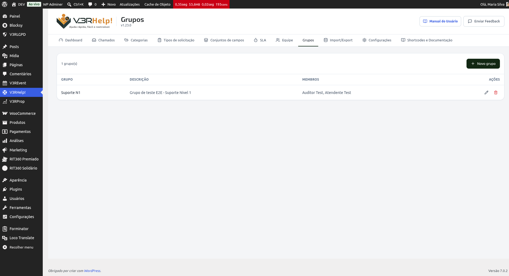
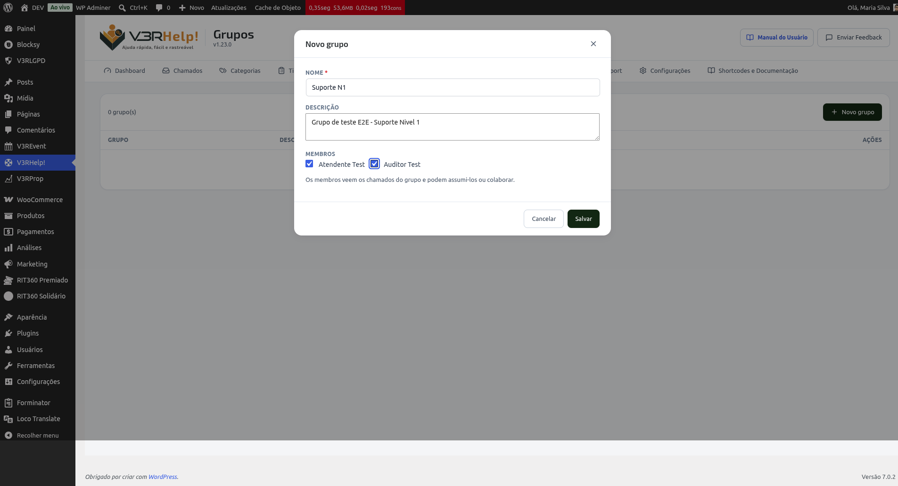
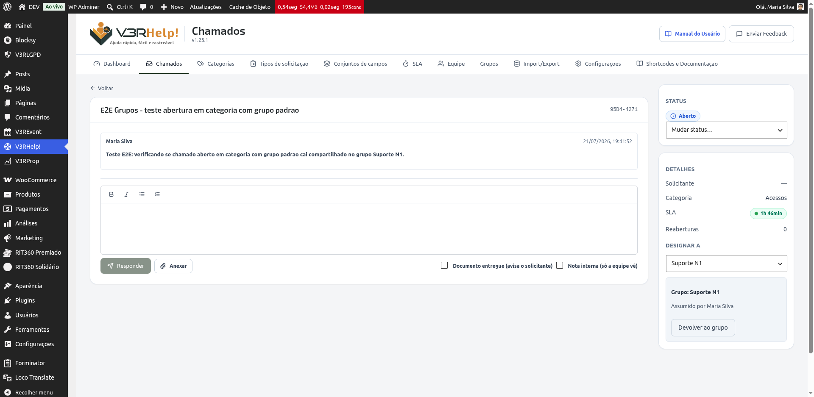

# Grupos
{: .no_toc }

  

    Índice
  

  {: .text-delta }
1. TOC
{:toc}

Na tela **V3RHelp! > Grupos** você reúne operadores em times (por exemplo, "Suporte N1" ou "Financeiro"). Um chamado pode ser designado a um grupo inteiro — e não a uma única pessoa —, para que a equipe trabalhe em conjunto.

## Por que isso é importante

Nem sempre o operador com menos chamados é o mais indicado para atender um caso: ele pode estar ocupado com outras tarefas, ou o chamado pode exigir um conhecimento específico. Designar a um **grupo** resolve isso: em vez de o sistema (ou você) escolher uma pessoa na hora, o chamado chega a todos os membros do time, que se organizam entre si.

A partir daí, duas coisas podem acontecer:

- **Trabalho conjunto** — todos os membros veem o chamado e podem responder na mesma conversa. Dá para dividir as tarefas de um caso mais complexo combinando pelas notas internas.
- **Alguém assume** — em casos mais simples, um operador clica em **Assumir** e o chamado passa a ser dele. Os demais continuam vendo o chamado, agora com o aviso de quem o assumiu.

## Criar um grupo

1. Na tela **Grupos**, clique em **Novo grupo**.
2. Dê um **nome** (ex.: "Suporte N1") e, se quiser, uma **descrição**.
3. Marque os **membros** do grupo — a lista traz os operadores já cadastrados na tela [Equipe](equipe).
4. Clique em **Salvar**.

{: .dica }
> Só quem está cadastrado como operador na tela **Equipe** aparece para virar membro de um grupo. Cadastre a pessoa lá primeiro.

## Designar um chamado a um grupo

Há três caminhos:

- **Automático, por categoria ou tipo de solicitação** — em [Categorias](categorias) (ou no construtor de [Formulários](formularios)), defina um **Grupo padrão**. Todo chamado novo daquela categoria/tipo cai direto no grupo, sem escolher um operador individual.
- **Manual, pelo painel** — no detalhe do chamado, use o seletor **Designar a**: ele lista os **Operadores** e os **Grupos** separadamente. Escolha um grupo para deixar o chamado compartilhado.
- **Manual, pela Central** — supervisores e operadores autorizados têm o mesmo seletor na página pública da Central.

## Assumir e devolver

No detalhe de um chamado que está com um grupo, os membros veem um bloco com o nome do grupo:

- Enquanto **compartilhado**, aparece o botão **Assumir**. Ao clicar, o chamado passa a ser seu e mostra "Assumido por *você*".
- Depois de assumido, o dono (ou um supervisor) vê o botão **Devolver ao grupo**, que solta o chamado de volta para o time.

{: .dica }
> Assumir é sempre uma ação explícita — responder um chamado do grupo **não** o transfere para você automaticamente. Assim ninguém "rouba" um caso só por comentar.

## Quem vê o quê

- **Supervisores** veem todos os chamados, com ou sem grupo.
- **Operadores** veem os chamados designados a eles **e** os designados aos grupos de que fazem parte — inclusive depois que um colega assume (com o selo "Assumido por…"), para não perder o acompanhamento.
- **Solicitantes** não veem grupos: para quem abre o chamado, nada muda.

## E-mails

- Quando um chamado é designado a um grupo, **todos os membros** recebem um aviso.
- Quando alguém **assume** o chamado, os **demais** membros são avisados de quem pegou — evitando que duas pessoas comecem o mesmo atendimento.

Esses avisos podem ser ligados ou desligados em **Configurações > Notificações**.
