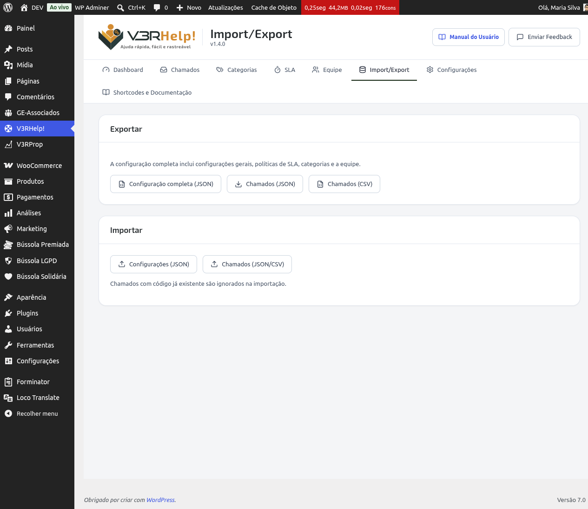

# Importar / Exportar
{: .no_toc }

  

    Sumário
  

  {: .text-delta }
1. TOC
{:toc}

O módulo **Importação/Exportação** permite levar e trazer dados do V3RHelp!: configurações completas ou chamados, em JSON ou CSV. Ele fica em **V3RHelp! > Importação/Exportação**.

{: .atencao }
> Este recurso faz parte do plano Pro. Se o seu site ainda estiver no plano gratuito, o módulo aparece bloqueado.

## Exportar

A exportação é separada em **Configuração** e **Dados**:

- **Configuração (JSON)**: exporta configurações gerais, políticas de SLA e categorias — o que serve para **replicar numa nova instância**. **Não** inclui operadores nem chamados.
- **Dados: chamados + operadores (JSON)**: exporta todos os chamados (com o estado de cada um) e a equipe (operadores), preservando a estrutura por completo.
- **Chamados (CSV)**: exporta os chamados em formato de planilha (CSV), ideal para abrir no Excel, Google Sheets ou similar (só os chamados; sem operadores).

Clique no botão correspondente e o arquivo é baixado automaticamente para o seu computador.

{: .importante }
> Exportar a configuração completa é o seu seguro contra perda de dados ou erros de configuração. Faça isso antes de qualquer mudança grande (ex.: alterar políticas de SLA, reorganizar categorias) para poder recuperar o estado anterior se algo sair errado.

## Importar

Duas opções de importação estão disponíveis:

- **Configurações (JSON)**: importa um arquivo de configuração exportado anteriormente, restaurando configurações gerais, políticas de SLA e categorias. (Arquivos de configuração antigos, que também traziam a equipe, continuam sendo importados normalmente.)
- **Dados: chamados + operadores (JSON/CSV)**: importa chamados a partir de um arquivo JSON ou CSV. No JSON de dados, os **operadores** também são aplicados (por e-mail) — por isso, **importe a configuração antes**, para que as categorias já existam.

Selecione o arquivo e confirme a importação. O sistema processa os dados e informa quantos itens foram importados.

### Deduplicação por código

Ao importar chamados, o sistema verifica o código de cada chamado no arquivo. Se já existir um chamado com aquele código no site, ele é **ignorado** — não é duplicado nem sobrescrito.

{: .importante }
> Graças à deduplicação por código, você pode reimportar um arquivo de chamados quantas vezes precisar sem medo de criar duplicatas. Isso é útil, por exemplo, para reprocessar uma importação que falhou parcialmente.

## Casos de uso comuns

- **Backup periódico**: exporte a **Configuração** e os **Dados** regularmente (ex.: antes de atualizações do plugin ou mudanças estruturais) e guarde os arquivos em local seguro.
- **Migrar de um site para outro**: exporte Configuração e Dados no site de origem; no destino, importe **primeiro a Configuração** (para criar categorias/SLA) e **depois os Dados** (chamados + operadores).
- **Replicar a configuração-padrão em uma nova instalação**: exporte a **Configuração** de um site já ajustado e importe-a numa nova instalação para começar com categorias e SLA prontos — sem levar junto os operadores nem os chamados do site de origem.

{: .atencao }
> Guarde os arquivos exportados em local seguro — eles podem conter dados dos chamados, incluindo informações de clientes. Prefira CSV quando quiser abrir e analisar os dados em uma planilha; use JSON quando o objetivo for reimportar os dados no V3RHelp!, pois ele preserva a estrutura completa.
