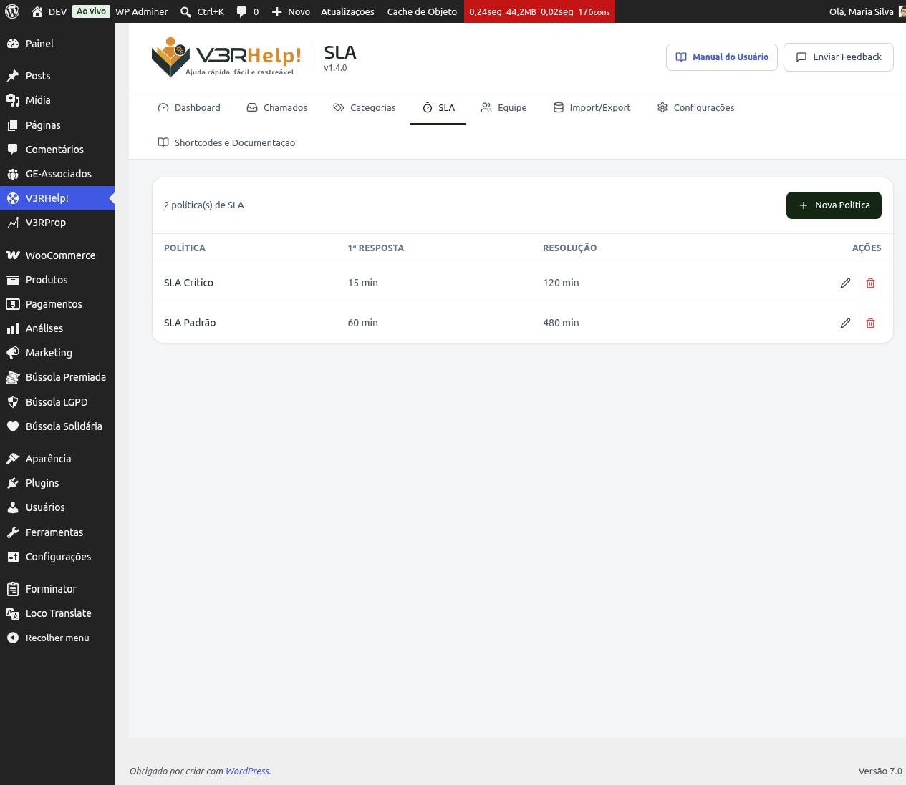

# SLA
{: .no_toc }

  

    Índice
  

  {: .text-delta }
1. TOC
{:toc}

## O que é SLA

SLA (veja a definição completa em [Definições](/definicoes/#sla-prazo-de-atendimento)) é o compromisso de prazo que sua equipe assume com quem abre um chamado. No V3RHelp, cada política de SLA define quanto tempo a equipe tem para dar a primeira resposta e quanto tempo tem para resolver o chamado por completo.

## Como criar uma política

1. Acesse **V3RHelp! > SLA**.
2. Clique em **Nova Política**.
3. Preencha:
   - **Nome** — um nome que identifique a política, como "Padrão" ou "Urgente".
   - **Primeira resposta** — o prazo, em minutos, para o primeiro contato com quem abriu o chamado.
   - **Resolução** — o prazo, em minutos, para o chamado ser totalmente resolvido.
4. Salve a política.
5. Vá até **Categorias** e ligue a política de SLA à categoria desejada. A partir daí, todo chamado dessa categoria passa a ter prazo.

Você também pode editar ou excluir uma política existente a qualquer momento, na mesma tela.

## Primeira resposta x Resolução

- **Primeira resposta** é o tempo até alguém da equipe dar sinal de vida no chamado — nem que seja só para dizer "recebemos, já estamos olhando".
- **Resolução** é o tempo até o chamado ser efetivamente encerrado, com o problema resolvido.

{: .importante }
> **Por que isso é importante:** uma resposta rápida, mesmo que ainda sem solução, já reduz a ansiedade de quem abriu o chamado. Ele sabe que foi visto e que alguém está cuidando do caso.

## O semáforo de prazo

O V3RHelp calcula o SLA 24 horas por dia, 7 dias por semana, e mostra um semáforo em cada chamado:

- 🟢 **No prazo** — ainda há tempo confortável para atender.
- 🟡 **Em atenção** — o chamado já consumiu 75% ou mais do prazo.
- 🔴 **Vencido** — o prazo estourou.

Quando um chamado entra em atenção ou fica vencido, a equipe recebe um lembrete por e-mail (esses avisos podem ser ajustados em **Configurações > Notificações**).

{: .importante }
> **Por que isso é importante:** o semáforo tira da equipe a necessidade de ficar calculando prazos de cabeça. Basta olhar a cor para saber o que priorizar primeiro — e ninguém precisa descobrir um chamado vencido por acaso.

{: .exemplo }
> A política "Padrão" define primeira resposta em **120 minutos** (2 horas) e resolução em **1440 minutos** (24 horas). Um chamado dessa categoria aberto às 9h precisa de uma primeira resposta até as 11h e deve estar resolvido até as 9h do dia seguinte.
