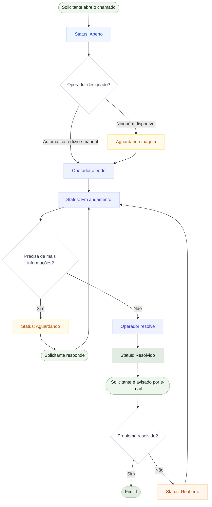

# Como usar bem o V3RHelp
{: .no_toc }

Aqui o conceito vira prática. Primeiro, entenda **a jornada de um chamado** do começo ao
fim; depois, veja o passo a passo para o **seu perfil**.

  
Nesta página

- TOC
{:toc}

---

## A jornada de um chamado

Todo chamado percorre um caminho parecido. O diagrama abaixo mostra esse fluxo — do momento
em que alguém pede ajuda até o encerramento.

{: .dica }
> Cada caixa colorida corresponde a um **status** do chamado. Os mesmos nomes aparecem no
> painel e no [glossário](/definicoes/#status).

---

## Para a equipe de suporte

Você é **operador** ou **supervisor**. Seu trabalho acontece no painel do WordPress, no menu
**V3RHelp!**.

### Seu dia a dia como operador

1. Abra o menu **V3RHelp! > Chamados** e veja a fila.
2. Use os **filtros** (status, categoria) e a **busca** para achar o que importa.
3. Abra um chamado, **leia o pedido** e, se ainda não tiver dono, **assuma** (designe-se).
4. **Responda** ao solicitante de forma clara; use **nota interna** para registros da equipe.
5. Precisa de algo do solicitante? Mude para **Aguardando** e peça a informação.
6. Resolveu? Mude para **Resolvido** — o solicitante é avisado automaticamente.

O detalhe do chamado também mostra o **Ambiente do solicitante** (navegador, sistema, tela),
capturado na abertura — isso ajuda a diagnosticar sem precisar perguntar.

### Como supervisor, além disso

1. Acompanhe o **Dashboard** (abertos, tempo médio, sem operador) para enxergar a operação.
2. Ajuste **Categorias** e **políticas de SLA** conforme a realidade da equipe.
3. Cuide da **Equipe** (operadores e supervisores) e do que cada um atende.
4. Configure as **Notificações** (inclusive lembretes de chamados parados) em **Configurações**.

Cada uma dessas telas é detalhada em [Módulos](/modulos/).

---

## Para quem abre chamados

Você acessa o V3RHelp por uma **página do site** (a Central de Atendimento), não pelo painel.

1. Acesse a página de atendimento indicada pela sua organização.
2. Clique/role até **Abrir chamado** e preencha: assunto, categoria e uma boa descrição.
   (Veja como caprichar no relato em [Guia de Quem Abre Chamados](/guia-solicitante/).)
3. **Anexe** prints ou arquivos que ajudem a entender.
4. Envie. Você recebe um **e-mail de confirmação** com o número do chamado e um botão para
   acompanhar.
5. A cada resposta da equipe, você é avisado por e-mail. Responda pelo próprio chamado.

{: .exemplo }
> Se você **não tem conta** no site, tudo bem: ao abrir o chamado você informa seu nome e
> e-mail e recebe um **magic link** — um link seguro para acompanhar e responder sem precisar
> criar login.
